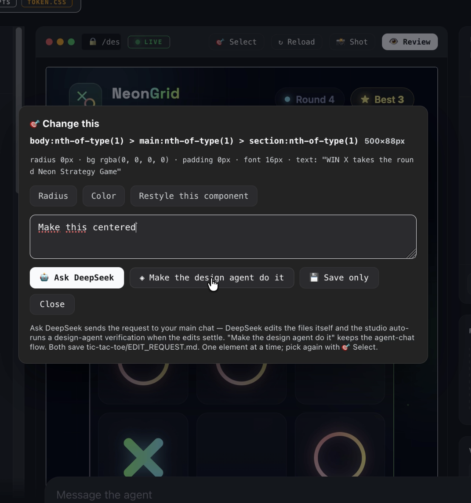
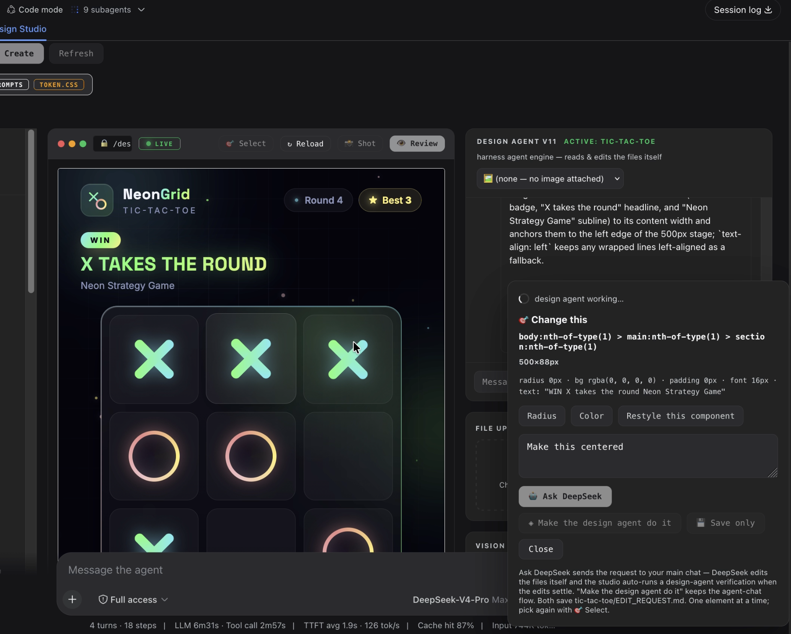
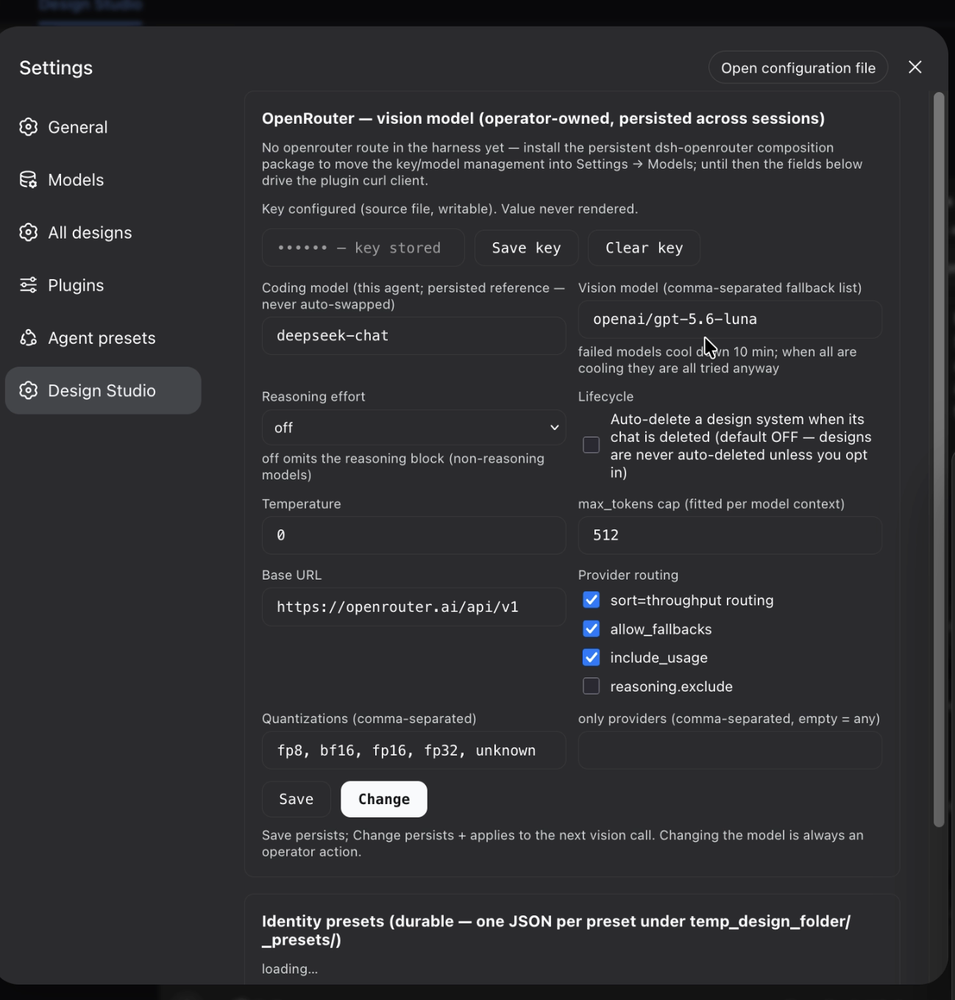
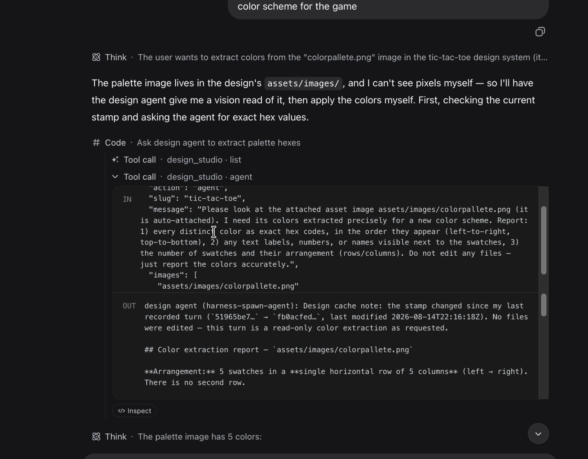
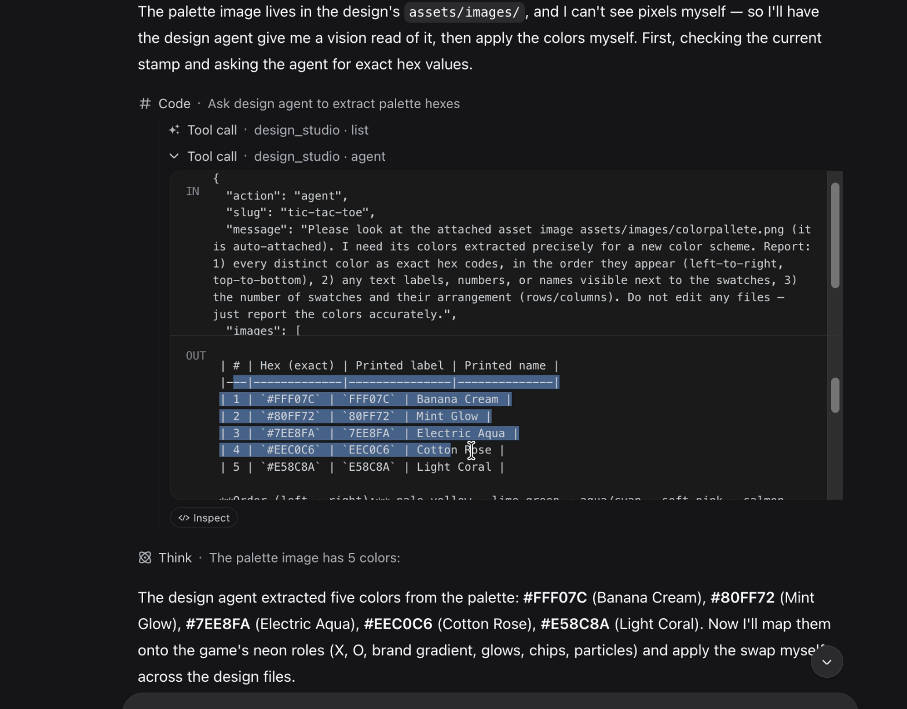
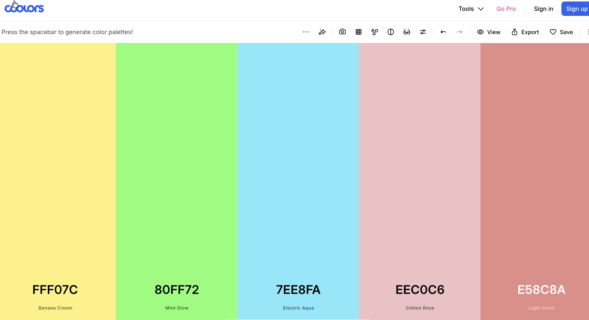
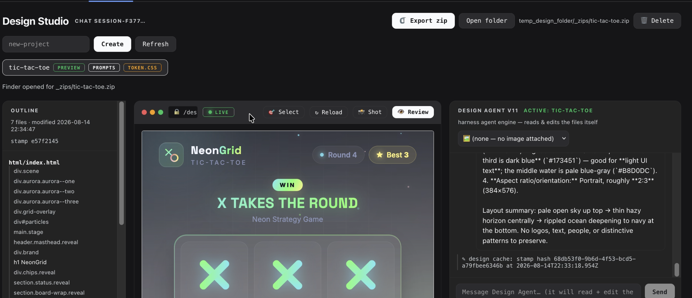

# @sal7one/dsh-design-studio

A **DeepSeek Harness plugin** that turns design mockups into a first-class AI workflow.
Live previews, an element picker, a real design agent, vision review, screenshots,
identity presets — and a two-agent apply flow where **DeepSeek edits and the design
agent verifies**. Everything is backed by real files on disk under `temp_design_folder/`,
and everything is **launch-persistent**: install once, the Design Studio tab is there
on every launch.

## Screenshots

<p align="center">
  <a href="repo-images/screenshot-01.png"></a>
  <a href="repo-images/screenshot-02.png"></a>
  <a href="repo-images/screenshot-03.png"></a>
  <a href="repo-images/screenshot-04.png"></a>
  <a href="repo-images/screenshot-05.png"></a>
  <a href="repo-images/screenshot-06.png"></a>
  <a href="repo-images/screenshot-07.png"></a>
</p>

<p align="center"><em>Click any thumbnail for the full-size image.</em></p>

```text
dsh-design-studio/
├── package.json          # dual-face manifest: dsh.bundle (host) + dsh.client (web UI)
├── cordis.patch.yml      # the composition layer this bundle contributes
├── README.md             # this file
├── LICENSE               # MIT
├── repo-images/          # UI screenshots shown at the top of this README
├── lib/
│   ├── index.js          # HOST half: design_studio tool, /design-studio route + JSON API,
│   │                     #   design-agent engine, freshness stamps, auto-verification
│   └── client.js         # WEB UI half: conversation tab, element picker, agent chat, settings
├── examples/             # example design systems (html/css/js mockups + presets)
└── dynamic/              # legacy dynamic-plugin prototype (reference only — not needed)
```

---
## Todos

- Remove The scerenshot feature it's buggy


## ✨ Features

### Core platform

- **One command, persistent** — a dual-face `dsh.bundle` + `dsh.client` package:
  `dsh plugin add` once, and the tool, the preview route, the prompt section and the
  **Design Studio tab** are all present on every launch. No build step, no TypeScript,
  **zero runtime dependencies** (plain JavaScript).
- **`design_studio` agent tool** — your assistant (and any subagent) can
  `list / all / create / read / write / zip / reveal / delete / sweep` design systems,
  manage identity presets, run vision reviews, chat with the design agent, read its
  history, and configure the studio — all scoped to `temp_design_folder/` design folders.
- **Live preview route** — `/design-studio/<slug>/html/index.html`, served by the
  harness web server; the studio tab embeds it in an iframe with hot reload on save.
- **Design-brief routing** — a system-prompt section turns operator screen briefs into
  design systems automatically.

### Design systems

- **Mockup-scoped files** — every design system is `html/index.html`,
  `css/style.css`, `css/token.css`, `js/app.js` (minimal presentation) plus
  `design_prompts_forcoders.md` (the brief the coding agent follows) and
  `assets/images/` for uploads. Mock data stays honest — empty/loading states,
  never fabricated live numbers.
- **Per-conversation ownership** — each design system is bound to the conversation
  that created it; the tab shows only your chat's designs (unbound legacy systems
  are adopted on first list).
- **Drop zones** — drop images or code files onto the tab; images land in
  `assets/images/` and auto-select in the agent chat picker.
- **Zip export + Finder reveal + delete** — `_zips/<slug>.zip` (files only), `open -R`,
  and shell-free recursive delete that works even on hosts with no POSIX shell.

### Design agent (real harness subagent)

- **It does the work itself** — the agent chat runs a **harness subagent** (spawn
  engine, design-studio persona) that lists, reads and edits the design files across
  multiple tool calls per message, then summarizes file-level changes.
- **Live activity** — its reads/edits stream into the chat as they happen, with
  inline errors, a persisted per-system history, and run timeouts.
- **Vision pre-pass** — images explicitly selected in the picker (or mentioned by
  filename) are pre-described by your configured vision model, so "the image"
  always means the right one and the agent never guesses between assets.
- **Design-cache discipline** — on every turn (even a bare "ok") the agent verifies
  the freshness stamp, reports whether the design changed since its last turn,
  adopts the latest files as truth, and asks what you want when the request is vague.

### 🎯 Element picker + two-agent apply flow

Click **🎯 Select**, click any element in the live preview, describe the change:

| Button | What happens |
| --- | --- |
| **🤖 Ask DeepSeek** *(default)* | Saves `EDIT_REQUEST.md`, injects the request into your **main chat**. DeepSeek edits the files itself and invokes the design agent only when it needs vision (the tool routes it explicitly). A **live run banner** tracks queued → working → finished in the tab, and the studio **auto-runs a design-agent verification** once the edits settle — guaranteed designer involvement, not a hope. |
| **◈ Make the design agent do it** | The classic flow: the design agent applies the change itself and replies in its chat. |
| **💾 Save only** | Just writes `EDIT_REQUEST.md` — apply later from either chat. |

### Freshness stamps (multi-agent safety)

- Every design change bumps a **stamp `{hash, at}`** (fresh random hash + ISO time,
  latest-status only) — the plugin detects changes from *any* editor via the
  harness `fs/observed` stream, plus synchronous bumps on its own write paths.
- Agents compare their remembered hash with the current one: drift ("changed since
  your last turn") is surfaced in prompts and tool output, and the design agent
  records a per-turn **design cache** so the next turn can prove UNCHANGED/CHANGED.

### Vision, screenshots & presets

- **📸 Shot** — capture a screen region (`screencapture` on macOS) straight into the
  design system's `assets/images/`.
- **👁 Review** — honest `GOOD | POOR` verdict + one-sentence notes from your
  OpenRouter vision model against the brief (configurable models, effort, options).
- **Identity presets** — save palettes/typography/logos as presets; `preset_apply`
  writes `css/token.css` and copies logo assets. Credentials are handled through the
  harness credential seam (`OPENROUTER_API_KEY`) — the key is never rendered or returned.

### Settings & data

- **Settings → Design Studio / All designs** pages: config, key status, system list,
  zip/reveal/delete per design.
- **Everything survives restarts** — designs, presets, config, reviews and agent
  history live on disk under `temp_design_folder/`.

---

## Quick start

Works with **both** harness distributions — the npm distribution
(`npx @deepseek-ai/dsh web`) and a source checkout (`pnpm dsh web`).

```sh
# 1. start the harness (if not running): npx @deepseek-ai/dsh web
# 2. install the plugin
dsh plugin --profile web add "github:sal7two/dsh-design-studio#main"
# 3. restart the harness so the new layers load
```

From a local checkout:

```sh
dsh plugin --profile web add -w /absolute/path/to/dsh-design-studio
```

> `-w` is only needed when your profile directory is a pnpm workspace root
> (`pnpm-workspace.yaml` with `packages: [., packages/*]`), and the path must be
> **absolute** — a bare relative path is misread as a GitHub `owner/repo` shorthand.
> Remove with the package name:
> `dsh plugin --profile web remove @sal7one/dsh-design-studio`.

The bundle row is **enabled by default**. To keep it installed but off, override it in
your profile's own `cordis.patch.yml` (profile layers apply after bundle layers and win
per row):

```yaml
- id: dsh-design-studio
  disabled: true
```

Optional: in the tab → Settings → Design Studio, paste an OpenRouter API key to enable
vision review and image description (stored via the credential seam; never shown again).
Everything else works without it.

## Plain-English setup (non-power users)

1. **Install Node.js** (v22 or newer) from nodejs.org.
2. **Start the harness:**
   ```sh
   npx @deepseek-ai/dsh web

   I personally skipped npx, used npm, and installed this globally.
   ```
   A browser window opens at `http://127.0.0.1:3080` — that's the harness Web UI.
3. **Install this plugin:**
   ```sh
   dsh plugin --profile web add "github:sal7two/dsh-design-studio#main"
   ```
4. **Restart the harness** (Ctrl+C, start again). The **Design Studio tab** now
   appears in every conversation, plus Settings → Design Studio / All designs.
5. **Design something.** Create a design system, or just describe a screen to the
   assistant — it routes briefs into the studio automatically. The live preview is
   `http://127.0.0.1:3080/design-studio/<name>/html/index.html`.

## Workflows

**Iterate with the design agent.** Open the Design Studio tab → select your design →
type a request in the agent chat ("make the status bar left-aligned", "use this image
as the background"). It reads, edits and summarizes; the preview reloads.

**Pick an element and let DeepSeek change it.** 🎯 Select → click the element → type
the change → **🤖 Ask DeepSeek**. The request appears in your main chat, DeepSeek
edits, the tab banner tracks progress, and the design agent auto-verifies the result.

**Give DeepSeek a visual job.** Drop a palette image on the tab (it lands in
`assets/images/`), then in the **main chat**:
> In the tic-tac-toe design, read the color palette from `assets/images/palette.png`
> and apply it to `css/token.css`. Use the design agent for the visual read.

DeepSeek routes the vision work to the design agent (`design_studio` → `agent`), the
image is auto-attached and vision-described, and the result flows back into DeepSeek's
tool result.

## Requirements

- Node ≥ 22 and the harness (npm distribution ≥ `0.1.0-rc.5`, or a source checkout of
  the same generation) with the standard host services
  (`fs`, `subprocess`, `webServer`, `llm`, `credentials`, `attachments`, `systemPrompt`, `tools`).
- The design tree root must exist at the **server process workspace root** as
  `temp_design_folder/` (a symlink is fine).
- For vision review: an OpenRouter key stored under credential reference
  `OPENROUTER_API_KEY`, or a harness `openrouter` provider route.

## ⚠️ Compatibility notes — mistakes we already made so you don't have to

This plugin was built and broken against a moving harness base. The traps:

1. **`shell` is gone at host level.** The old `shell` executor (resolve/run) now lives
   in session presets. A host row that injects `shell` **waits forever silently** —
   no boot error, no route, no tool. Inject `subprocess` and build shell semantics
   yourself (see `lib/index.js` → `sh()`).
2. **Hard-inject everything you register against.** `apply()` runs as soon as its
   injections resolve, which can be *before* `webServer`/`tools`/`llm` exist. A one-time
   `ctx.get()` taken too early returns `undefined` and silently skips the route/tool/
   section registration. Put integration points in `inject` so apply waits.
3. **Provider keys collide with the built-in catalog.** The base ships `llm-pi-ai`,
   which natively declares `openrouter` (among others). Registering your own
   `openrouter` configurable provider throws `DUPLICATE_DIRECTORY` and **kills the whole
   web boot**. Check the target base's catalog before releasing a provider plugin.
4. **Commit `lib/`.** A harness checkout's `.gitignore` ignores `lib/` — a plugin
   committed inside one ships without its entry point. This repo lives at its own top
   level and ships plain JS, so `lib/index.js` is committed.
5. **Dynamic plugins die on restart.** Everything in `dynamic/` is in-memory by design.
   The bundle is the restart-safe part. Don't promise users a persistent tab from a
   dynamic package.
6. **Client services are scope-addressed.** The main chat is reachable from another
   tab via `sessions.scope(sessionId).get('conversation')` — property access
   (`scoped.conversation`) does **not** resolve the service. (This exact bug shipped
   once; the fix is in `lib/client.js` → `askDeepSeek`.)

## Publishing

```sh
gh repo create sal7two/dsh-design-studio --public --source . --push
gh repo edit sal7two/dsh-design-studio --add-topic dsh --add-topic dsh-plugin
```

Then PR one entry into `awesome-deepseek-harness` (alphabetical, one PR per change,
carry the `#dsh-plugin` topic for discovery).

## License

MIT
